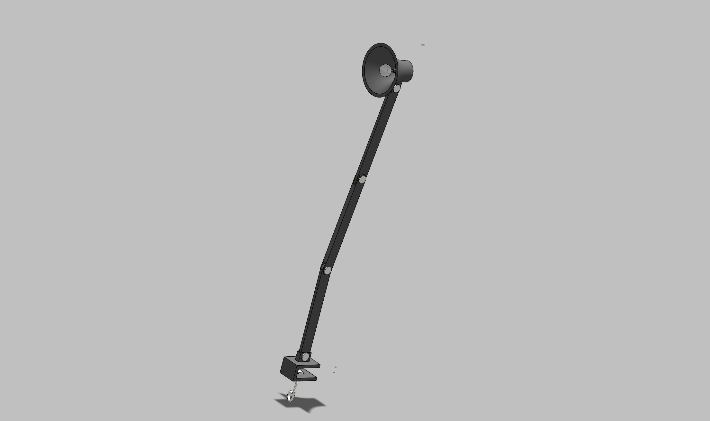

# Lamp Project — Adjustable SolidWorks Assembly

## Project Overview

I designed this adjustable lamp in SolidWorks as a multi-part mechanical assembly. The project includes the individual lamp components, articulated arm sections, pivot joints, the base/clamp, lamp head, assembly configurations, and engineering drawings.

The goal of the project was to create the parts individually, assemble them with the correct relationships, and make the lamp move as an adjustable assembly rather than only creating a static model.

🎥 **[Watch the Lamp Project Video on YouTube](https://www.youtube.com/watch?v=V_siRCXMmso&t=526s)**

🎥 **[Watch the Cinematic Motion Demonstration](https://www.youtube.com/watch?v=WbKL276J6CM)**

## CAD Design

I modeled the lamp as multiple SolidWorks parts and then brought the components together into assemblies. The design uses several connected arm sections and pivot points so the position of the lamp can be adjusted.

The project gave me practice working with:

- Multi-part SolidWorks assemblies
- Part modeling and feature creation
- Assembly mates
- Moving/articulated components
- Mechanical joints and pivot points
- Configurations
- Component fit and alignment
- Engineering drawings
- Design organization across multiple SolidWorks files

## Assembly Motion

One of the main parts of this project was making sure the lamp assembly could move. I used the assembly relationships to allow the arm sections and lamp head to change position around their joints while keeping the components connected correctly.

I also created a cinematic motion demonstration showing the adjustable lamp moving through different positions.

🎥 **[Cinematic Lamp Motion Video](https://www.youtube.com/watch?v=WbKL276J6CM)**

## Engineering Drawings

In addition to the 3D models and assemblies, I created SolidWorks engineering drawings for the project. This allowed me to practice presenting the design in a technical drawing format in addition to the 3D CAD environment.

**[View SolidWorks Drawings](drawings/)**

## CAD Files

The SolidWorks project files are organized by file type so the individual components, assemblies, and drawings are easy to review.

- **[Individual SolidWorks Parts](parts/)** — Individual `.SLDPRT` component models
- **[SolidWorks Assemblies](assemblies/)** — Lamp assemblies and configurations
- **[Engineering Drawings](drawings/)** — SolidWorks `.SLDDRW` drawing files

## 3D Printing & Physical Prototype

**Status: In progress**

The next stage of this project is manufacturing the lamp components with a 3D printer and assembling the physical prototype.

Once the parts are printed, I will document:

- Print orientation and support decisions
- Print settings where relevant
- Fit between mating components
- Joint and pivot movement
- Dimensional or tolerance problems
- Any CAD revisions made after testing the physical parts
- Photos of the printed components and completed lamp

This will let me compare the SolidWorks design with the actual manufactured parts and make changes if the physical prototype reveals problems that were not obvious in CAD.

## Current Project Status

- [x] Individual CAD parts modeled
- [x] Lamp assembly created
- [x] Adjustable assembly motion established
- [x] Engineering drawings created
- [x] Project videos recorded
- [ ] Components 3D printed
- [ ] Physical assembly completed
- [ ] Fit and motion tested
- [ ] Final design revisions completed

## Project Takeaway

This project helped me practice going beyond individual SolidWorks parts and working with a complete mechanical assembly. The adjustable joints required me to think about how the components fit together and how the assembly should move. The upcoming 3D-printing stage will let me test those decisions with a physical prototype and revise the design if necessary.
